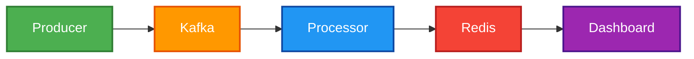

Project: Real-Time Analytics Pipeline (Local Demo)
This project is a local, containerized demonstration of a distributed real-time analytics pipeline, similar to the architecture used to process 100K+ events per minute in a production environment.

It uses a microservices architecture to simulate, ingest, process, and visualize real-time web clickstream data.

Technologies Used:
  Python: For data production, processing, and the dashboard API.
  Kafka: As a distributed, fault-tolerant message bus for ingesting events.
  Redis: As a high-speed, in-memory data store for live-updating counters and analytics.
  Docker / Docker Compose: To containerize and orchestrate all 5 services (Producer, Processor, Dashboard, Kafka, Redis).

Architecture Diagram

How It Works

producer.py: A Python script that generates fake click events ({'user_id': '...', 'page': '...'}) and sends them to a Kafka topic.

processor.py: A Python "consumer" that reads from the Kafka topic, parses the JSON, and increments a counter for that webpage in a Redis hash.

dashboard.py: A Flask web application that queries Redis for the latest counts and displays them on a simple HTML page that auto-refreshes every second.

How to Run

Clone this repository.

Ensure you have Docker and Docker Compose installed.

From the root directory, run: docker-compose up --build

Open your browser to http://localhost:5000 to see the live dashboard.

Scaling This to Production (AWS)

This local setup is a blueprint for a full-scale cloud deployment:

Kafka would be replaced with Amazon MSK.

Redis would be replaced with Amazon ElastiCache.

The Python containers would be deployed on AWS Fargate or EKS with auto-scaling to handle the load.
